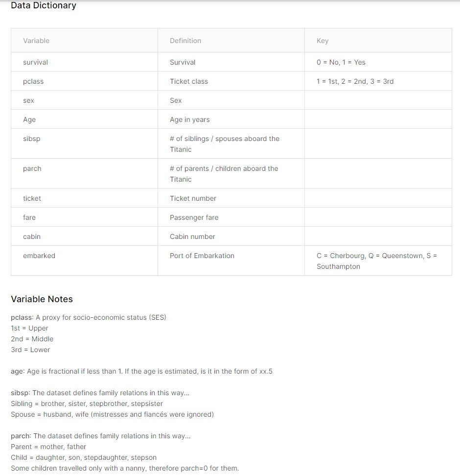

```{r setup, include=FALSE}
knitr::opts_chunk$set(echo = TRUE)
```

\newpage  

---
  
# Titanic - Machine Learning from Disaster. Kaggle competition.  

---


```{r message= FALSE, warning=FALSE}
require(tidyverse)
require(lares)
require(GGally)
require(knitr)
require(kableExtra)
require(gridExtra)
require(DescTools)

```


# Descripción del dataset. ¿Por qué es importante y qué pregunta/problema pretende responder?  

## Lectura y analisis previo del dataset.  
  
  
  
```{r message= FALSE, warning=FALSE, fig.height=6, fig.width=9}

df <- read_csv('../data/train.csv')

df$Survived <- factor(df$Survived)
df$Pclass <- factor(df$Pclass)
df$Sex <- factor(df$Sex)
df$SibSp <- factor(df$SibSp)
df$Parch <- factor(df$Parch)
df$Embarked <- factor(df$Embarked)

summary(df)
df_str(df)


```
Creamos la variable dicotómica `Child` para diferenciar los niños de los adultos (>12años).  

Creamos la variable `n_ticket` con el número de peraonas que viajan con el mismo ticket.  

Separamos del `Name` el título (`title_name`) y el primer apellido (`first_name`).  

Simplificamos `title_name` en cuatro niveles.  

# Integración y selección de los datos de interés a analizar. 

```{r message= FALSE, warning=FALSE, fig.height=10, fig.width=12}

df <- df %>%
  mutate(Child=factor(Age<=12))

df <- left_join(df, df %>%
                  group_by(Ticket) %>%
                  summarize(n_ticket=n())) %>%
  mutate(n_ticket=factor(n_ticket))

df <- df %>%
  separate(Name, c('first_name', 'rest_name'), sep=', ', remove=F) %>%
  separate(rest_name, c('title_name', 'rest_name'), sep='\\.') %>%
  select(-rest_name)

df$title_name[df$title_name %in% c('Capt', 'Col', 'Don', 'Dr', 'Jonkheer', 'Major', 'Rev', 'Sir')] <- 'Mr'
df$title_name[df$title_name %in% c('Lady', 'Mme','the Countess')] <- 'Mrs'
df$title_name[df$title_name %in% c('Mlle', 'Ms')] <- 'Miss'
df$title_name <- factor(df$title_name)

df %>%
  select(where(is.factor)) %>%
  na.omit() %>%
  pivot_longer(-Survived) %>%
  group_by(name, value, Survived) %>%
  summarize(n=n()) %>%
  mutate(prop=prop.table(n)) %>%
  pivot_longer(c(n,prop), names_to='tipo', values_to='val') %>%
  ggplot(aes(x=interaction(name,value, lex.order = T), y=val, fill=Survived)) + 
    geom_bar(stat='identity', position='stack') +
    facet_grid(tipo ~ ., scale='free_y') +
    theme(axis.text.x = element_text(angle = 90, vjust = 1, hjust=1))

df %>% 
  select(Survived, where(is.numeric), -PassengerId) %>%
  ggpairs(aes(color=Survived))

```


# Limpieza de los datos.  

## ¿Los datos contienen ceros o elementos vacíos? ¿Cómo gestionarías cada uno de estos casos?  

Sustituimos los NA's de la variable Child con los siguientes criterios:

|     Asumimos que los viajeros con ticket unipersonal con SibSp==0 (sin hermanos o esposa a bordo) y Parch==0 (sin hermanos o padres a bordo) no son niños.

|     Asumimos que las personas con title_name=='Mrs' (mujeres casadas) no son niños.  

|     Asumimos que las personas con title_name=='Master' son niños.  

|     Asumimos que las personas con SibSp>0 y Parch>0  son niños.  


```{r message= FALSE, warning=FALSE}

df <- df %>%
  mutate(Child=if_else(SibSp==0 & Parch==0 & is.na(Child) & n_ticket==1, FALSE, as.logical(Child))) %>%
  mutate(Child=if_else(title_name=='Master' & is.na(Child), TRUE, as.logical(Child))) %>%
  mutate(Child=if_else(title_name=='Mrs' & is.na(Child), FALSE, as.logical(Child))) %>%
  mutate(Child=if_else(SibSp > '0' & Parch > '0' & is.na(Child), TRUE, as.logical(Child))) %>%
  mutate(Child=if_else(is.na(Child), FALSE, as.logical(Child)))


prop.table(table(df$Survived, df$Child, dnn=c('Survived', 'Child')), margin=2)

```


## Identificación y tratamiento de valores extremos.  

# Análisis de los datos.   

## Selección de los grupos de datos que se quieren analizar/comparar (planificación de los análisis a aplicar).  

## Comprobación de la normalidad y homogeneidad de la varianza.  

## Aplicación de pruebas estadísticas para comparar los grupos de datos. En función de los datos y el objetivo del estudio, aplicar pruebas de contraste de hipótesis, correlaciones, regresiones, etc. Aplicar al menos tres métodos de análisis diferentes.  

```{r message= FALSE, warning=FALSE}

df %>%
  select(Survived, where(is.factor)) %>%
  pivot_longer(-Survived) %>%
  group_by(name) %>%
  summarize(phi=Phi(x=Survived, y=factor(value)), 
            chisq.pvalue=chisq.test(Survived, factor(value))$p.value) %>%
  mutate(`signif 95%`=chisq.pvalue < 0.05) %>%
  arrange(chisq.pvalue) %>%
  kable(format='latex', digits=4, caption='Phi y chisq.test') %>%
  kable_styling(full_width = F, latex_options = "HOLD_position")

df %>%
  select(Survived, where(is.numeric), -PassengerId) %>%
  pivot_longer(-Survived) %>%
  group_by(name, Survived) %>%
  summarize(value_list = list(value)) %>%
  pivot_wider(names_from=Survived, values_from=value_list) %>%
  mutate(vartest.pval=var.test(unlist(`0`), unlist(`1`))$p.val) %>%
  mutate(ttest.pval=t.test(unlist(`0`), unlist(`1`), var.equal=vartest.pval>0.05)$p.val) %>%
  mutate(`signif 95%`=ttest.pval < 0.05) %>%
  select(-`0`, -`1`)  %>%
  kable(format='latex', digits=4, caption='t.test') %>%
  kable_styling(full_width = F, latex_options = "HOLD_position")

```


# Representación de los resultados a partir de tablas y gráficas.  

# Resolución del problema. A partir de los resultados obtenidos, ¿cuáles son las conclusiones? ¿Los resultados permiten responder al problema?  
